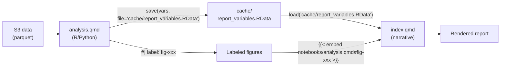

# Agent guide: reports2

This file orients AI agents so they can work effectively in this repo — writing reports, building analysis notebooks, and managing data — without reading the entire codebase.

## What this repo is

**reports2** is [Switchbox's](https://switch.box/) report repository. Switchbox is a nonprofit think tank that produces rigorous, accessible data on U.S. state climate policy for advocates, policymakers, and the public.

Each report is a [Quarto Manuscript](https://quarto.org/docs/manuscripts/) project that combines a **policy narrative** (`index.qmd`) with **reproducible data analysis** (`notebooks/analysis.qmd`), using R (tidyverse) and Python (polars). Reports are published as static HTML via GitHub Pages, reviewed as Word documents, and typeset as PDFs via InDesign.

The main inputs are data from S3 (`s3://data.sb/`): NREL ResStock building simulations, Cambium marginal costs, EIA energy data, Census PUMS, and utility tariff data. The main outputs are publication-quality reports on energy policy — heat pump rates, grid impacts, gas infrastructure, LMI programs, and building electrification.

The companion repo [rate-design-platform](https://github.com/switchbox-data/rate-design-platform) runs the CAIRO rate simulations whose outputs many reports analyze. See its AGENTS.md for simulation-side conventions.

## Layout

| Path                           | Purpose                                                                                                           |
| ------------------------------ | ----------------------------------------------------------------------------------------------------------------- |
| `reports/`                     | Source code for all report projects. Each subdirectory is a self-contained Quarto Manuscript project.             |
| `reports/.style/`              | Shared SCSS theme (`switchbox.scss`) and HTML includes (`switchbox.html`) used by all reports.                    |
| `reports/references.bib`       | Shared BibTeX bibliography used by all reports.                                                                   |
| `lib/`                         | Shared R and Python libraries used across reports.                                                                |
| `lib/ggplot/switchbox_theme.R` | Custom ggplot2 theme (IBM Plex Sans, white background, Switchbox colors). Source this in every analysis notebook. |
| `lib/rates_analysis/`          | Shared R functions for heat pump rate analysis (bill calculation, tariff assignment, plotting).                   |
| `lib/eia/`                     | Python scripts for fetching EIA data (fuel prices, state profiles).                                               |
| `docs/`                        | Published HTML reports served via GitHub Pages at `switchbox-data.github.io/reports2`.                            |
| `tests/`                       | Pytest test suite.                                                                                                |
| `.devcontainer/`               | Dev container configuration (Dockerfile, devcontainer.json).                                                      |
| `Justfile`                     | Root task runner: `install`, `check`, `test`, `new_report`, `aws`, `clean`.                                       |
| `pyproject.toml`               | Python dependencies (managed by uv).                                                                              |
| `DESCRIPTION`                  | R dependencies (managed by pak).                                                                                  |

## Report architecture

Every report project lives in `reports/<project_code>/` and follows the Quarto Manuscript structure. This separation between narrative and analysis is the core architectural pattern — understand it before touching any report.

### Anatomy of a report project

```text
reports/<project_code>/
├── index.qmd              # The publication narrative (what readers see)
├── notebooks/
│   └── analysis.qmd       # The data analysis (the engine room)
├── _quarto.yml            # Quarto project config
├── Justfile               # render, draft, typeset, publish, clean
├── cache/                 # Gitignored: .RData files, intermediate outputs
└── docs/                  # Gitignored: rendered HTML/DOCX/ICML output
```

- **`index.qmd`**: The report's narrative. Contains prose, embedded charts, inline computed values, and margin citations. This is what the reader sees. It loads pre-computed variables and embeds figures from the analysis notebook. It never loads raw data or runs heavy computation.
- **`notebooks/analysis.qmd`**: The data analysis. Loads data from S3, computes statistics, generates labeled figures, and exports variables to `.RData`. Readers don't see this directly — its outputs flow into `index.qmd`. Prefer a single `analysis.qmd`; consult the team before adding multiple notebooks.
- **`_quarto.yml`**: Project config. Type is always `manuscript`. Theme always references `../.style/switchbox.scss`. The `render` list must include all notebooks needed for the build.

### Data flow: analysis to narrative



1. `analysis.qmd` loads data from S3, computes, and `save()`s variables to a `.RData` file in `cache/`.
2. `analysis.qmd` creates labeled figures using chunk options like `#| label: fig-energy-savings`.
3. `index.qmd` loads variables via `load(file = "cache/report_variables.RData")` and uses them inline: `` `r total_savings |> scales::dollar()` ``.
4. `index.qmd` embeds figures from the analysis notebook: ``.

Never put raw data loading or heavy computation in `index.qmd`. Never put narrative prose in `analysis.qmd`.

### YAML frontmatter template

Every `index.qmd` uses this frontmatter (adapt title, authors, date, keywords):

```yaml
---
title: "Report Title"
subtitle: "Descriptive subtitle"
date: YYYY-MM-DD
author:
  - name: Author Name
    orcid: 0000-0000-0000-0000
    email: name@switch.box
    affiliations:
      - Switchbox

keywords: [keyword1, keyword2]

bibliography: ../references.bib
license: "CC BY-NC"

toc: true
notebook-links: false
reference-location: margin
fig-cap: true
fig-cap-location: margin
tbl-cap-location: margin

appendix-style: default
citation-location: document
citation:
  container-title: Switchbox

# Uncomment when PDF is ready:
#other-links:
#  - text: PDF
#    icon: file-earmark-pdf
#    href: switchbox_<project_code>.pdf
---
```

### Embedding figures and variables

In `analysis.qmd`, create a labeled figure:

````markdown
```{r}
#| label: fig-energy-savings
#| fig-cap: "Annual energy savings by heating fuel type"

ggplot(data, aes(x = fuel_type, y = savings)) +
  geom_col() +
  theme_minimal()
```
````

In `index.qmd`, embed it:

```markdown
:::{.column-page-inset-right}

:::
```

Use `:::{.column-page-inset-right}` or `:::{.column-page-inset}` for full-width layout (the standard for all charts).

For inline values, always use R inline code. Never hardcode statistics in prose:

```markdown
Gas-heated homes pay a median annual energy bill of **`r pre_hp_total_bill |> scales::dollar(accuracy = 1)`**.
```

## Analysis notebook conventions

This section covers the **literate programming style** of `notebooks/analysis.qmd` — the engine room that powers each report. All analysis notebooks are open-sourced alongside the report, so they must be readable and followable by anyone who knows the language.

The guiding principle: **a reader who knows R (or Python) should be able to follow the analysis without external documentation.** They should understand what data is being loaded, what it looks like, what transformations are applied and why, and how each output connects to the report. The notebook is not a script with comments — it is a document that happens to execute.

For polished reference implementations, see [tdr-model/notebooks/analysis.qmd](https://github.com/switchbox-data/tdr-model/blob/main/notebooks/analysis.qmd) (LMI discount modeling) and [ny_heat/notebooks/analysis.qmd](https://github.com/switchbox-data/reports/blob/main/src/ny_heat/notebooks/analysis.qmd) (Census PUMS energy burden analysis).

### Top-level structure

Analysis notebooks follow a consistent arc that mirrors the research process:

1. **Introduction** — A short, reader-facing welcome. Since these notebooks are open-sourced, the intro orients an external reader: what this notebook contains, how it relates to the report, and how to navigate (e.g., "click Download Source above"). It can also list caveats and limitations up front. From ny_heat: "This notebook, written in the R programming language, contains all of the code used to produce the findings in our report, starting from raw data."

2. **Setup** — Import libraries and define top-level parameters. Each parameter gets a brief comment or prose explanation. Group related parameters together and show their values (e.g., render a discount rate table with `gt()`). Parameters like `state_code`, `burdened_cutoff`, and `pums_year` should be defined here so the notebook can be rerun for a different state or scenario by changing a few values. If the analysis can be rerun with different parameters, include a "How to run this for X" subsection with numbered steps.

3. **Import data** — Load each dataset, explain what it contains, print it. This is the single most important section for readability. (See "Show the data on import" below.)

4. **Data preparation** — Filtering, joining, reweighting, tier assignment. Each transformation gets its own cell with a prose explanation of _what_ is being done and _why_.

5. **Core analysis** — The analytical functions and computations that produce the report's findings. Functions are defined in one cell, then called in subsequent cells. Complex functions get docstring-style prose above them.

6. **Visualization** — Figure-producing cells, each with `#| label: fig-xxx` and `#| fig-cap:` options. Group figures by the story they tell, not by chart type.

7. **Report variables** — A clearly labeled section at the end that computes the summary metrics used in `index.qmd` and exports them via `save.image()` or `save()`.

### Show the data on import

This is a policy, not a suggestion. When you load a dataset, **immediately show it** so the reader can reason about subsequent code. The pattern is:

1. Load the data.
2. Explain what it represents in prose.
3. Print a sample (first few rows via `gt()`, `head()`, or `glimpse()`).
4. If the schema isn't obvious, include a markdown table documenting the columns.

From the TDR model:

> "Each row in this table represents a housing unit. It could be a single-family home, or an apartment in a multi-family building. The ResStock data contains the following columns:"
>
> | Column            | Description                             |
> | ----------------- | --------------------------------------- |
> | `bldg_id`         | Unique identifier for each housing unit |
> | `assigned_income` | Annual household income (2024 dollars)  |
> | ...               | ...                                     |

Then later:

> "Let's take a look at the electricity and gas tariff data."

followed by a `gt()` table rendering the tariff data with formatted currency and percentages.

This applies equally to intermediate datasets. After a complex join or transformation, use a **checkpoint** — print a few rows and walk the reader through the new columns:

> "Let's take a look at where we stand."

Then explain what each new variable means in prose: "We know whether each household in our sample `is_energy_burdened`: whether they pay more than `r scales::label_percent()(burdened_cutoff)` of their annual income on energy." Note the use of inline R code even in the analysis notebook's own prose — this keeps the notebook parameterized.

When a dataset has encoding quirks, explain them. From ny_heat, on Census PUMS data:

> "ACS uses low values of these columns to denote different reasons for zeros, not actual values, so we need to set them to zero."

Without that comment, the `case_when(GASP <= 4 ~ 0)` would be mystifying.

### Cell size and atomicity

Each code cell should do **one logical thing**. If you're loading data, load data. If you're computing survey weights, compute survey weights. If you're making a plot, make a plot. Do not combine unrelated operations in a single cell.

Good:

```r
# Cell 1: Load electricity tariff data
elec_tariff <- googlesheets4::read_sheet(url, sheet = elec_sheet) |>
  select(utility, customer_charge, volumetric_rate, month, current_discount)
```

```r
# Cell 2: Show it
elec_tariff |> gt() |>
  fmt_currency(columns = c(customer_charge, volumetric_rate), decimals = 4)
```

Bad: A single cell that loads three datasets, joins them, filters, computes a summary, and makes a plot.

### Prose between cells

The prose between code cells is **informal, conversational, and directional**. It tells the reader what is about to happen and why it matters. It is not a formal methods section — it is a running commentary from a colleague walking you through their work.

Characteristic phrases:

- "First, we define a function to..."
- "Next, we read the ResStock data, excluding buildings with..."
- "We now need to match each housing unit to the correct HEAP tier, based on..."
- "Let's take a look at..."
- "Let's run a quick sanity check, ensuring that..."
- "These target percentages are stored in the Google Sheets and would need to be updated to model a different utility."

The tone is second-person-inclusive ("we") and present-tense ("we define", "we load", "we now need to"). It reads like pair programming.

### Introduce domain concepts where they're needed

Do not assume the reader knows what a HEAP tier is, or how survey weights work, or what a volumetric rate means. Introduce domain concepts **at the point in the code where they first matter**, not in a separate glossary.

From the TDR model, right before the tier-assignment code:

> "HEAP tiers are defined as:"
>
> | HEAP Tier    | Income Level         |
> | ------------ | -------------------- |
> | Lowest tier  | Less than 100% FPL   |
> | Middle tier  | 100%-200% FPL        |
> | Highest tier | 200% FPL to 60% SMI  |
> | Non-LMI      | Greater than 60% SMI |
>
> _FPL = federal poverty level, SMI = state median income._

Then the code that implements this mapping follows immediately. The reader learns the concept and sees the implementation in one scroll.

Sometimes domain education needs more than a definition table. From ny_heat, the explanation of Census PUMAs spans several paragraphs — what they are, why they matter for the analysis, how they relate to counties, why the allocation factor is needed — before the join code appears. The reader gets a mini-lesson, not just a glossary entry. This is appropriate when the concept is central to the analysis and would be confusing without context.

When a concept has external documentation that the curious reader might want, **link to it**:

> "For definitions of other PUMS variables, consult the official [data dictionary](https://www2.census.gov/programs-surveys/acs/tech_docs/pums/data_dict/PUMS_Data_Dictionary_2021.pdf). To learn how to work with PUMS data, check out [this tutorial](https://walker-data.com/tidycensus/articles/pums-data.html)."

This keeps the notebook self-contained for the casual reader while giving the motivated reader a path to go deeper.

### Orient the reader to what matters vs. boilerplate

Not every cell is equally important. Some are setup boilerplate (library imports, DB connection functions); others are the analytical core. Use prose to **signal which is which**:

- Before boilerplate: "First, we import the libraries we'll use in this notebook." (Then the cell. No further explanation needed.)
- Before core logic: Multiple paragraphs explaining the analytical approach, what the function computes and why, what the inputs and outputs represent.

The TDR model's `eval_discount_rate` function, for example, gets a full prose section ("Core Analysis Functions") with a numbered list of what the functions calculate — monthly bills, program costs, energy burdens, impact on non-LMI customers — before any code appears.

For visualization sections, annotate each figure group with what it demonstrates:

> "### Figure 3: Impact of Increasing Discounts —
> Shows how different discount rates affect
> lowest tier households and middle tier households
> (who get intermediate discount).
> Key findings discussed in report section 'Discount Rate Analysis'"

### Verification and sanity checks

Include assertions and verification steps throughout, not just at the end. After loading data, after joining, after reweighting — anywhere a silent error could propagate. Present them conversationally:

> "Let's run a quick sanity check, ensuring that each housing unit only appears in one row of each of these datasets."

```r
stopifnot(dim(bldgs_elec)[1] == length(unique(bldgs_elec$bldg_id)))
```

For survey weight verification, print a comparison table of weighted vs. target percentages and label it clearly:

```r
print("Electric - Weighted vs Target Percentages")
```

### Comments in code cells

Comments inside code cells should explain **why**, not **what**. The prose between cells handles the "what."

Good comments:

```r
filter(!bldg_id %in% exclude_bldgs)  # Remove buildings with negative electricity consumption
bill * (1 - current_discount)  # Apply current discount to LMI bills only
sum((bill - bill_discounted) * survey_weight)  # Must be weighted for cost-per-kwh calculation
```

Comments that explain **data encoding quirks** are especially valuable:

```r
GASP = case_when(GASP <= 4 ~ 0, .default = GASP),  # ACS uses low values to denote reasons for zeros, not actual dollar amounts
```

Bad comments:

```r
# Read the data
# Filter the data
# Calculate the sum
```

### Inline computed values in prose

Use inline R code (`` `r expr` ``) in the notebook's own prose — not just in `index.qmd`. This keeps the notebook parameterized and self-updating:

> "We know whether each household in our sample `is_energy_burdened`: whether they pay more than `` `r scales::label_percent()(burdened_cutoff)` `` of their annual income on energy."

If `burdened_cutoff` changes from 0.06 to 0.10, the prose updates automatically.

### Caching expensive fetches

When a data fetch is expensive (e.g., Census API calls), use a conditional download pattern so the notebook doesn't re-fetch every time it renders:

```r
if (file.exists(pums_path)) {
  raw_data <- readRDS(pums_path)
} else {
  raw_data <- get_pums(variables = vars, state = state_fips, ...)
  saveRDS(raw_data, pums_path)
}
```

Explain the pattern briefly in prose so the reader knows what's happening.

### Define metrics before computing them

Before a block of aggregation code, list the exact metrics you're about to compute. This gives the reader a roadmap so they can map each line of code to its purpose. From ny_heat:

> "All that's left now is to report the following metrics for different geographies, starting with the entire state:
>
> - `households_included`: the number of households
> - `median_income`: the median income of households across the state
> - `pct_energy_burdened`: the percent of households that are energy burdened
> - `avg_monthly_bill_of_burdened`: the average monthly energy bills of those households, before NY HEAT
> - `utility_burden_of_burdened`: how much utility burdened households stand to save every month, after NY HEAT"

Then the `summarise()` cell follows, and every column is already explained.

### Repeat-and-slice with progressive shortening

Many analyses compute the same metrics across multiple slicing dimensions — by building type, by fuel type, by income level, by ownership status. The pattern is always: **count → aggregate → plot → table**.

The first time through (e.g., building type), give the full treatment: explain what you're doing, why, how the categories are defined, and what the results show. By the second and third time (fuel type, income), the reader already knows the pattern. Shorten the prose to telegraphic transitions:

> "Next, we crunch the same numbers for each economic region:"
>
> "Now we do it for counties:"
>
> "Plot counts."
>
> "Aggregate results by fuel type."
>
> "Place results in a table."

This progressive shortening respects the reader's time. They learned the pattern once; they don't need it re-explained for every dimension.

### The report variables section

Every analysis notebook ends with a clearly labeled section that computes summary metrics for `index.qmd`. This section should:

1. Be explicitly labeled (e.g., `# Report variables`).
2. Include a prose note explaining its purpose: "Each variable calculated here corresponds to a metric in the report. You can see where they are used by searching for the variable name in Index.qmd."
3. Compute formatted values using `scales::dollar()`, `scales::percent()`, etc.
4. Export everything via `save.image(file = "cache/report_variables.RData")` or a targeted `save()`.

### Figure cells

Figure-producing cells always include these Knitr chunk options:

```r
#| label: fig-descriptive-name
#| fig-cap: "Human-readable caption that stands alone"
#| fig-width: 10
#| fig-cap-location: margin
```

Group figures by the story they tell, not by chart type. Use markdown headers and prose before each figure group to orient the reader to what the figure shows and what the key findings are.

### What NOT to do in analysis notebooks

- Do not write a wall of code with no prose. Every 2-3 cells should have connecting text.
- Do not load data without showing it. The reader cannot follow joins and filters on data they've never seen.
- Do not define 10 functions in one massive cell. Break them into logical groups with prose between.
- Do not rely on comments alone to explain logic. If it needs more than a one-line comment, write prose above the cell.
- Do not put narrative conclusions in the analysis notebook. State what the _code_ is doing and what the _data_ shows; save the policy interpretation for `index.qmd`.
- Do not hardcode file paths that only work in one environment. Use relative paths or environment variables.
- Do not skip the report variables section. If `index.qmd` uses computed values, they must be exported from `analysis.qmd`.

## Shared resources and branding

### Theme and styling

- `reports/.style/switchbox.scss`: Custom Quarto theme. Switchbox brand colors: sky (`#68bed8`), carrot (`#fc9706`), midnight (`#023047`), saffron (`#ffc729`), pistachio (`#a0af12`). Fonts: Farnham (body text), GT Planar (headings), IBM Plex Sans (tables/charts), SF Mono (code). Do not override these in individual reports.
- `reports/.style/switchbox.html`: Shared HTML include for figure caption formatting.

### ggplot2 theme

Source `lib/ggplot/switchbox_theme.R` at the top of every R-based analysis notebook:

```r
source("/workspaces/reports2/lib/ggplot/switchbox_theme.R")
```

This sets `theme_minimal()` as the base, uses IBM Plex Sans at 12pt, white panel background, and axis lines/ticks. Do not create custom themes or override these defaults.

### Switchbox color palette for charts

When using Switchbox colors in ggplot code, define them explicitly:

```r
sb_sky <- "#68bed8"
sb_carrot <- "#fc9706"
sb_midnight <- "#023047"
sb_saffron <- "#ffc729"
sb_pistachio <- "#a0af12"
```

### Shared R libraries

- `lib/rates_analysis/heat_pump_rate_funcs.R`: Bill calculation, tariff assignment, monthly/annual bill aggregation, LMI discount application, ResStock data processing.
- `lib/rates_analysis/heat_pump_rate_plots.R`: Plotting functions for rate analysis (histograms, supply rate plots).
- `lib/rates_analysis/create_sb_housing_units.R`: Creates standardized housing unit datasets from ResStock.

### Bibliography

`reports/references.bib` is the **single shared bibliography** used by every report (each report's YAML front matter points to it via `bibliography: ../references.bib`). It is auto-exported by Zotero from the "Reports" subcollection on JP's laptop — adding a reference to that Zotero collection automatically updates the `.bib` file in the local repo, but it only becomes available to others once committed and pushed to `main`. If you need to add a citation and don't have Zotero access, add the entry manually to `references.bib` following the key format below, and it will be reconciled on the next Zotero export.

Citation key format: `{author_short_title_year}`. When adding citations, follow this pattern:

```bibtex
@article{adams_BeingRebuffedRegulators_2024,
  title = {Being Rebuffed by Regulators...},
  author = {Adams, John},
  ...
}
```

## When to use R vs Python

- **R** (default): Data analysis, statistical modeling, data visualization, report notebooks. Use tidyverse for data manipulation, ggplot2 for charts, arrow for parquet I/O, gt for tables.
- **Python**: Data engineering scripts, numerical simulations, when a specific Python library is needed (e.g., geopandas for geospatial work, polars for large-scale data processing).
- Within a single analysis notebook, prefer consistency (usually all R).
- Both languages use Arrow/Parquet for data exchange and lazy evaluation for S3 reads.

## Working with data

All data lives on S3 (`s3://data.sb/`). Never store data files in git.

### Reading data

**R (preferred for analysis notebooks):**

```r
library(arrow)
library(dplyr)

lf <- open_dataset("s3://data.sb/eia/heating_oil_prices/")
result <- lf |>
  filter(state == "RI") |>
  group_by(year) |>
  summarize(avg_price = mean(price))
df <- result |> collect()
```

**Python:**

```python
import polars as pl

lf = pl.scan_parquet("s3://data.sb/eia/heating_oil_prices/*.parquet")
result = lf.filter(pl.col("state") == "RI").group_by("year").agg(pl.col("price").mean())
df = result.collect()
```

Stay in lazy execution as long as possible. Only `collect()` / `compute()` when you need the data in memory.

### S3 naming conventions

```text
s3://data.sb/<org>/<dataset>/<filename_YYYYMMDD.parquet>
```

- Lowercase with underscores. Date suffix reflects when data was downloaded.
- Always use a dataset directory, even for single files.
- Prefer Parquet format.

### Local caching

`data/` and `cache/` directories are gitignored. Use them for caching downloads and intermediate results, but the analysis must be reproducible from S3 alone. Never reference local-only files in committed code without a clear download/generation step.

## Code quality

Before considering any change done:

- **`just check`**: Runs lock validation (`uv lock --locked`) and pre-commit hooks (ruff-check, ruff-format, ty-check, trailing whitespace, end-of-file newline, YAML/JSON/TOML validation, no large files >600KB, no merge conflict markers).
- **`just test`**: Runs pytest suite. Add or extend tests for new or changed behavior.
- **`just render`** (from report directory): Verifies the report renders without errors. This is the reproducibility check — unique to a reports repo. Run it after any change to a report.

R formatting: Use the [air](https://github.com/posit-dev/air) formatter via the Posit.air-vscode editor extension (pre-installed in devcontainer). Not yet integrated with pre-commit hooks.

Python: Ruff for formatting and linting, ty for type checking.

## How to work in this repo

### Tasks

Use `just` as the main interface. Root `Justfile` for dev tasks, report `Justfile`s for rendering.

### Dependencies

- **Python**: `uv add <package>` (updates `pyproject.toml` + `uv.lock`). Never use `pip install`.
- **R**: Add to `DESCRIPTION` Imports section, then `just install`.

### Creating a new report

```bash
just new_report
```

Naming convention: `state_topic` (e.g., `ny_aeba_grid`, `ri_hp_rates`). Reuse topic names across states for consistency.

### Rendering

From the report directory:

```bash
just render    # HTML for web publishing
just draft     # DOCX for content review
just typeset   # ICML for InDesign
just publish   # Copy rendered HTML to root docs/ for GitHub Pages
```

### Publishing

1. `just render` and `just publish` from the report directory.
2. Return to repo root: `cd ../..`
3. `git add -f docs/` (force-add; `docs/` is gitignored in report dirs).
4. Commit, push, and merge to `main`. GitHub Pages deploys automatically.

### Computing contexts

- Data scientists' laptops (Mac with Apple Silicon)
- Devcontainers via DevPod (local Docker or AWS EC2 in us-west-2)
- Be aware of which context you're in (affects S3 latency and data access patterns).

### AWS

Data is on S3 in `us-west-2`. Refresh credentials with `just aws`.

## Commits, branches, and PRs

### Commits

- **Atomic**: One logical change per commit.
- **Message format**: Imperative verb, <50 char summary (e.g., "Add winter peak analysis").
- **WIP commits**: Prefix with `WIP:` for work-in-progress snapshots.

### Branches and PRs

- **PR title** MUST start with `[project_code]` (e.g., `[ny_aeba] Add peak analysis`) — this becomes the squash-merge commit message on `main`.
- **Create PRs early** (draft is fine). This gives the team visibility into in-flight work.
- PRs should **merge within the sprint**; break large work into smaller PRs if needed.
- **Delete branches** after merging.
- **Description**: Don't duplicate the issue. Write: high-level overview, reviewer focus, non-obvious implementation details.
- **Close the GitHub issue**: Include `Closes #<github_issue_number>` (not the Linear identifier).
- Do not add "Made with Cursor" or LLM attribution.

## Issue conventions

All work is tracked via Linear issues (which sync to GitHub Issues). When creating or updating tickets, use the Linear MCP tools. Every new issue MUST satisfy the following before it is created:

### Issue fields

- **Type**: One of **Code** (delivered via commits/PRs), **Research** (starts with a question, findings documented in issue comments), or **Other** (proposals, graphics, coordination — deliverables vary).
- **Title**: `[project_code] Brief description` starting with a verb (e.g., `[ny_aeba] Add winter peak analysis`).
- **What**: High-level description. Anyone can understand scope at a glance.
- **Why**: Context, importance, value.
- **How** (skip only when the What is self-explanatory and implementation is trivial):
  - For Code issues: numbered implementation steps, trade-offs, dependencies.
  - For Research issues: background context, options to consider, evaluation criteria.
- **Deliverables**: Concrete, verifiable outputs that define "done":
  - Code: "PR that adds ...", "Tests for ...", "Updated `data/` directory with ..."
  - Research: "Comment in this issue documenting ... with rationale and sources"
  - Other: "Google Doc at ...", "Slide deck for ...", link to external deliverable
  - Never vague ("Finish the analysis") or unmeasurable ("Make it better").
- **Project**: Must be set. Should match `reports/<project_code>/`.
- **Status**: Default to Backlog. Options: Backlog, To Do, In Progress, Under Review, Done.
- **Milestone**: Set when applicable (strongly encouraged).
- **Assignee**: Set if known.
- **Priority**: Set when urgency/importance is clear.

### Status transitions

Keep status updated as work progresses — this is critical for team visibility:

- **Backlog** -> **To Do**: Picked for the current sprint
- **To Do** -> **In Progress**: Work has started (branch created for code issues)
- **In Progress** -> **Under Review**: PR ready for review, or findings documented
- **Under Review** -> **Done**: PR merged (auto-closes), or reviewer approves and closes

## Conventions agents should follow

1. **Never hardcode computed values in prose.** Always use inline R code (`` `r var |> scales::dollar()` ``).
2. **Keep analysis in `notebooks/analysis.qmd`, narrative in `index.qmd`.** This separation is non-negotiable.
3. **Source `switchbox_theme.R`** in every analysis notebook. Use the Switchbox color palette.
4. **Add new citations** to `reports/references.bib` with `{author_short_title_year}` keys.
5. **Use ``** for figures. Never copy-paste chart code into `index.qmd`.
6. **Don't commit** `data/`, `cache/`, or report `docs/` directories.
7. **Prefer R** for analysis and visualization. Use Python only when there's a specific reason.
8. **Run `just check`** before considering a change done.
9. **Follow the writing conventions** in this file. Clear, direct, accessible, policy-oriented. No academic prose. No vague quantification. No passive voice for findings.
10. **Technical details go in the Appendix**, not the main text.
11. **Every figure needs a sentence before it** telling the reader what to look for.
12. **Use the conditional "would"** for modeled outcomes, never "will."
13. **When adding or removing files under `reports/`**, verify `_quarto.yml` render lists are updated.
14. **Respect data boundaries.** Don't assume large data is in git. Follow S3 paths documented in existing notebooks.
15. **Never under any circumstances** make a commit with agent attribution. Commits should never include "co-authored by Claude
or any similar message.
16. **Always** make sure commits are made with an appropriate message pass all pre-commit hooks, mypy tests, deptry tests, and ruff tests

## Quarto reference

Reports are built with [Quarto](https://quarto.org/) using the Manuscript project type. When writing or editing reports, consult these pages for authoritative syntax and options. Do not guess at Quarto syntax from training data -- fetch the docs at runtime via Context7 or web fetch.

| When you need to...                                        | Consult                                                                                       |
| ---------------------------------------------------------- | --------------------------------------------------------------------------------------------- |
| Understand the Manuscript project type                     | [Quarto Manuscripts](https://quarto.org/docs/manuscripts/)                                    |
| Write markdown (text, lists, footnotes, tables)            | [Markdown Basics](https://quarto.org/docs/authoring/markdown-basics.html)                     |
| Add or configure figures                                   | [Figures](https://quarto.org/docs/authoring/figures.html)                                     |
| Embed output from analysis notebooks                       | [Embedding from Other Documents](https://quarto.org/docs/authoring/notebook-embed.html)       |
| Use callout boxes (note, warning, tip)                     | [Callout Blocks](https://quarto.org/docs/authoring/callouts.html)                             |
| Control page layout (margin, page-inset, screen columns)   | [Article Layout](https://quarto.org/docs/authoring/article-layout.html)                       |
| Set up front matter (authors, abstract, license, citation) | [Front Matter](https://quarto.org/docs/authoring/front-matter.html)                           |
| Add citations and bibliographies                           | [Citations](https://quarto.org/docs/authoring/citations.html)                                 |
| Create cross-references to figures, tables, sections       | [Cross References](https://quarto.org/docs/authoring/cross-references.html)                   |
| Make the report itself citeable                            | [Creating Citeable Articles](https://quarto.org/docs/authoring/create-citeable-articles.html) |
| Configure appendices                                       | [Appendices](https://quarto.org/docs/authoring/appendices.html)                               |
| Add Mermaid or Graphviz diagrams                           | [Diagrams](https://quarto.org/docs/authoring/diagrams.html)                                   |
| Set Jupyter code cell options                              | [Code Cells: Jupyter](https://quarto.org/docs/reference/cells/cells-jupyter.html)             |
| Set Knitr (R) code cell options                            | [Code Cells: Knitr](https://quarto.org/docs/reference/cells/cells-knitr.html)                 |
| Configure HTML format options                              | [HTML Options](https://quarto.org/docs/reference/formats/html.html)                           |

The Article Layout page is especially important -- it documents the column classes (`column-page-inset-right`, `column-margin`, etc.) that we use for figure placement and margin content throughout our reports.

## MCP Tools

### Context7

When writing or modifying code that uses a library, use the Context7 MCP server to fetch up-to-date documentation. Do not rely on training data for API signatures or usage patterns.

### Linear

When a task involves creating, updating, or referencing issues, use the Linear MCP server to interact with the workspace directly. Follow the issue conventions above.

## Quick reference

| Command           | Where      | What it does                          |
| ----------------- | ---------- | ------------------------------------- |
| `just install`    | Root       | Set up dev environment                |
| `just check`      | Root       | Lint, format, typecheck               |
| `just test`       | Root       | Run pytest suite                      |
| `just new_report` | Root       | Create report from template           |
| `just aws`        | Root       | Refresh AWS SSO credentials           |
| `just clean`      | Root       | Remove generated files and caches     |
| `just render`     | Report dir | Render HTML                           |
| `just draft`      | Report dir | Render DOCX                           |
| `just typeset`    | Report dir | Render ICML for InDesign              |
| `just publish`    | Report dir | Copy HTML to `docs/` for GitHub Pages |
| `just clean`      | Report dir | Remove report caches                  |
